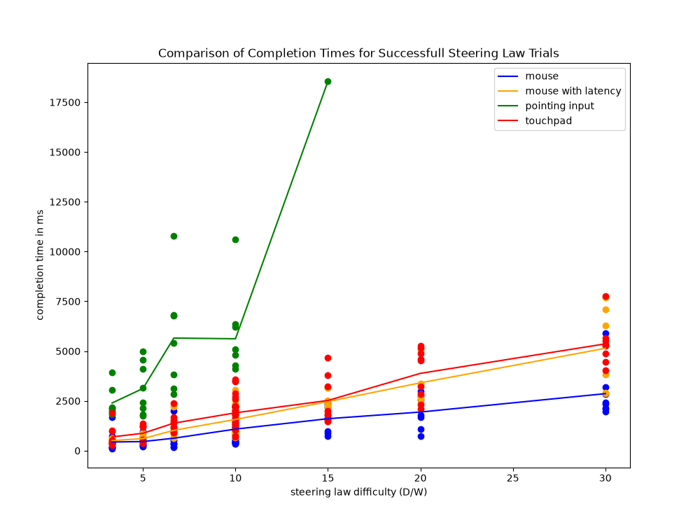
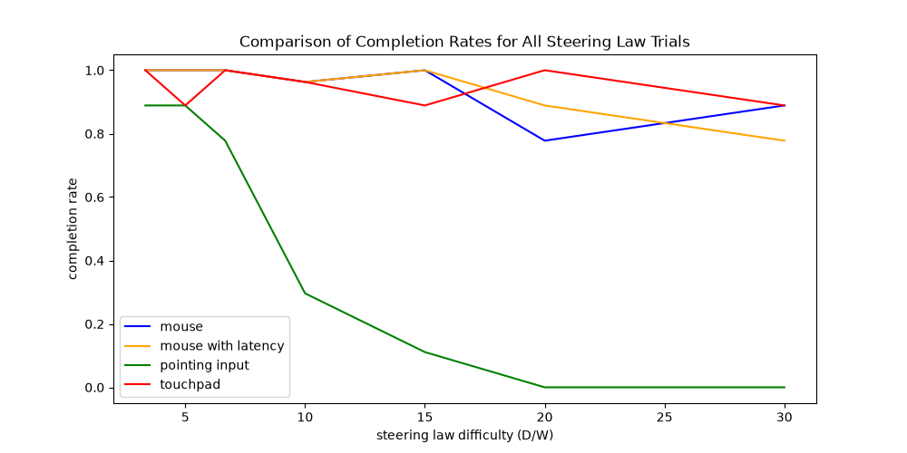

# Results
## Fitts' Law
The results for the Mixed Linear Model Regression showed that pose-based input was faster overall, and also showed and increase of mt dependent on the ID. Difficulty in general did not show any significant differences. The model however, failed to converge, so the results may be wrong. We also performed a Friedmann test on Input and Difficulty. For input, x2 = 1.97 and p = 0.58, meaning that there is no evidence that movement time differs across the different input methods. For ID, the results were x2 = 6.67 and p = 0.4644, which means there was also no statistically reliable evidence that the different difficulty levels had an impact on the movement time.
When examining the plots, one can see a large variation of movement times between the different trials and participants and that the mean times also do not rise with the index of difficulty (fitts_mt_subplots.png). The mean throughput of the different input methods also are quite similar to each other, but the variation is definitely higher for the latency and pose conditions (throughput_by_input.png). The mean throughput for each input per participant is also very similar for each participant, variation, however, was different for each participant and input

## Steering Law
The results for the Steering Law study show that mouse was the fastest input device condition for this task. This can be seen in the following plot: . In this plot you can also see that particpants using the mouse with latency were slower than when they were using the mouse (without latency). Using the touchpad particpants were a tiny bit slower than when using the mouse with latency.
When using the poiting input method particpants were a lot slower than with all the other conditions. The correlation between movement time and difficulty of the task seems to be linear for all input device conditions. However, the increase of movement time with higher diffuclty is a lot bigger for pointing input than for all the other conditions. The increase for mouse with latency and touchpad is just slightly bigger than for mouse (without latency) but still a lot lower than for pointing input. The comparison of completion rates also reveals that participants had problems with pointing input during the Steering Law study.  This plot shows that while the completion rate is high for mouse, mouse with latency and touchpad, it drops really fast for pointing input and also reaches zero at a difficulty of 20. The performed Friedmann test on Input and Difficulty showed no significant difference in movement times between the different input methods (p  = 0.528, p = 0.207 and p = 0.526). The test however also showed that the relationship between movement time and difficulty differs significantly across input modes. Compared to the mouse with latency condition, mouse input showed a significantly lower increase (interaction coefficient = -74 ms per difficulty unit) in movement time, p = 0.001 while pointing input showed a significantly higher increase (interaction coefficient = 653 ms per difficulty unit), p < 0.001. Touchpad input showed no significant difference, p = 0.677. This fits the plot for comparison of completion times.

# Discussion
## Fitts' Law
The test size with 3 participants was way too small to see actual differences. If one person was simply too fatigued or not doing as well with one of the tasks, it could have a major impact. Another factor is that the IDs might have simply been too close together to actually have an impact on the movement times. 

## Steering Law
Of couse the test size with 3 particpants was to small to really derive meaning from our analysis. Looking at the plot of completion times it is probable that there would be a significant difference between input modes (especially for pointing input) when testing with more particpants (so larger statistical power). The error rate also confirms that poitning input worked worse for participants in the Steering Law study. Probably, steadiness was a problem for particpants here. This problem may have emerged from the diffculty to really only move the index finger in a horizontal line but likly rather is a problem of the camera recognition required for this input technique. It is not surprising that an increase in difficulty with poiting input resulted in more problems (higher error rate and longer completion times) than the same increase for the other input device conditions. The effect that participants get used to latency and can complete the same task in the same time as without latency, could not be shown in our study. When using the mouse with latency participants took longer that when using the mouse without latency. Possibly this is because participants did not really have the chance to become used to the latency because of a small number of trials.

# Conclusion 

For Fitts' Law we can not identify a difference in thorughput between input modes. Neither the statistical analysis nor the plots show a signifcant/large difference here. In the Steering Law study however, participants had trouble with potining input leading to a really low completion rate and long completion times. While the statistical analysis did not show a significant difference because of a low number of participants the visual comparison leaves no doubt about this. Our results also showed that when the input condition was worse in terms of completion time, the increase of completion time was higher when increasing the difficulty by the same step. The assumption that higher difficulty leads to higher completion times and that the correlation between this is linear could also be comfirmed in our (small) study. Both for Fitts' Law and for Steering Law mouse was the best input option.